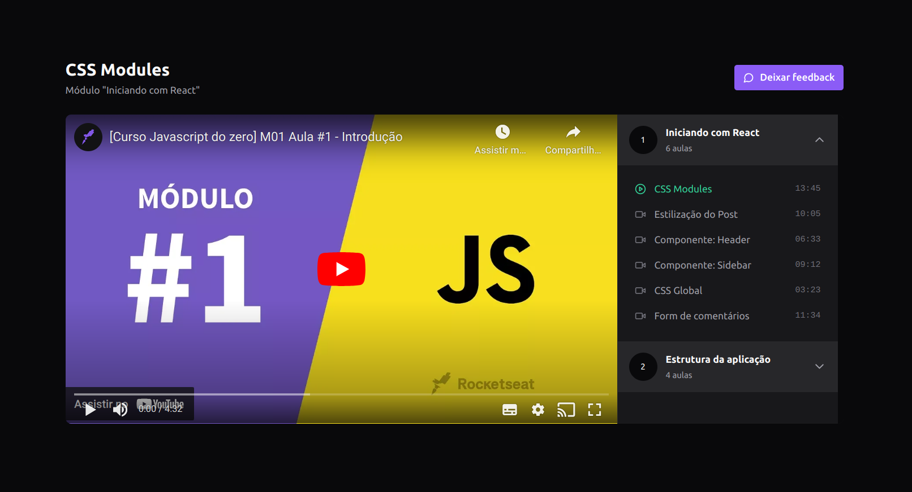

<h1 align="center">Course Platform</h1>

## Introdução

Course Platform é uma aplicação WEB de uma plataforma de cursos em vídeos.

É um projeto do curso de Reactjs Ignite 2022 que aborda conceitos de uso da biblioteca Redux.

<div align="center" >
  
</div>

## Requisitos

- Nodejs 16.20.0
- npm 8.19.4

## Tecnologias

- ReactJS
- Vite
- Typescript
- Tailwindcss
- Redux
- Axios
- Lucide React Icons
- Radix
- React Player
- Json Server
- Vitest


## Instalação

```sh
# Fazer o clone do projeto em uma máquina local
git clone https://github.com/marciovz/course-platform-reactjs-ignite2022.git
```

```sh
# Acessa a pasta do projeto
cd course-platform-reactjs-ignite2022
```

```sh
# Rodar a instalação das dependências do projeto
npm install
```

## Rodando a aplicação

```sh
# Rodar o json server
npm run server

# Rodar a aplicação localmente
npm run dev
```

Abrir a aplicação no navegador no endereço http://localhost:5173

